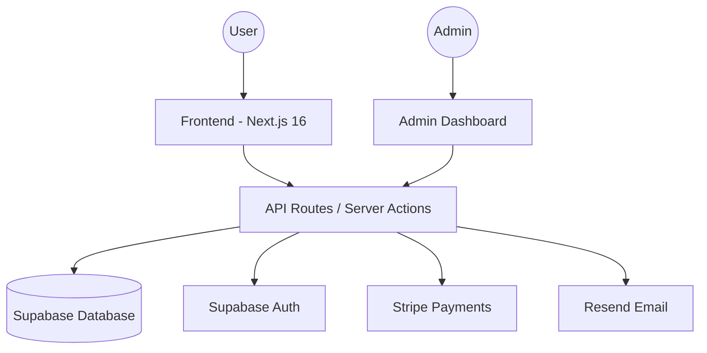

# GOLF-Fego — Play, Win & Give Back

**A premium golf charity subscription platform where your scores become your lucky numbers.**

---

## 🌟 Overview

GOLF-Fego is a modern platform that combines the passion for golf with charity support. Members subscribe monthly, enter their Stableford scores, and participate in manual and algorithmic draws for real prizes. A significant portion of every subscription goes directly to a charity of the member's choice.

## 🚀 Key Features

-   **Monthly Subscription Model:** Flexible plans (Monthly/Annual) with recurring revenue.
-   **Skill-Based Draws:** Your recent Stableford scores are used as your draw entries, rewarding active play.
-   **Charity Impact:** 10-30% of every subscription is donated to partner charities (Cancer Research UK, Oxfam, WWF, etc.).
-   **Admin Dashboard:** Full control over draw simulations, winner verification, and charity management.
-   **Real-time Leaderboards:** Track your performance and charity impact against other members.
-   **Secure Payments:** Integrated with Stripe for seamless subscription management.

## 💻 Tech Stack

-   **Frontend:** [Next.js 16](https://nextjs.org/) (App Router), [React 19](https://react.dev/), [Lucide Icons](https://lucide.dev/)
-   **Styling:** [Tailwind CSS 4](https://tailwindcss.com/), [Framer Motion](https://www.framer.com/motion/)
-   **Backend:** Next.js Server Actions & API Routes
-   **Database & Auth:** [Supabase](https://supabase.com/) (PostgreSQL & GoTrue)
-   **Payments:** [Stripe](https://stripe.com/)
-   **Email:** [Resend](https://resend.com/)

## 📖 Getting Started

To set up the project locally or deploy it to production, please refer to the [**Setup & Deployment Guide**](guide.md).

---

## 📈 Architecture

---

*Join 2,400+ golfers already playing with purpose.*
